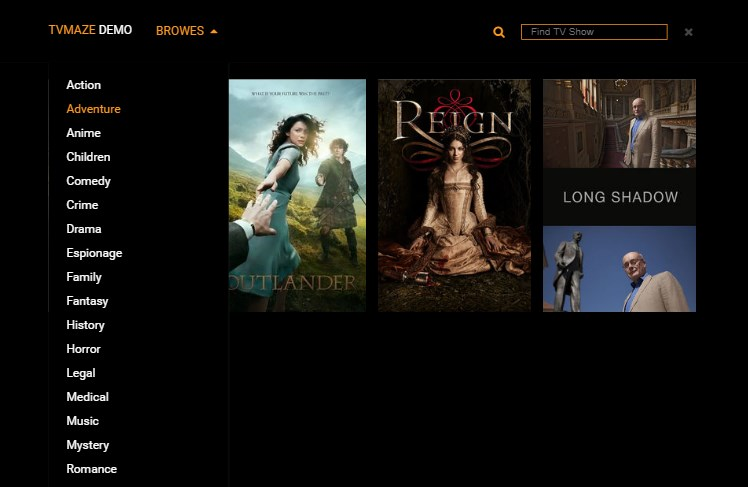

# TVMAZE DEMO

TVMAZE DEMO is a TV Show guide. This is an application based on pure Java Script, which uses REST API endpoint from www.tvmaze.com to display TV-shows (using AJAX requests). The app provides the search option by the name of the show or filtering shows by genre. It has been implemented with the module pattern and has a responsive layout.

## Getting Started

* Clone this GIT repository
* Go to the created folder and run `index.html`

## Screenshots

